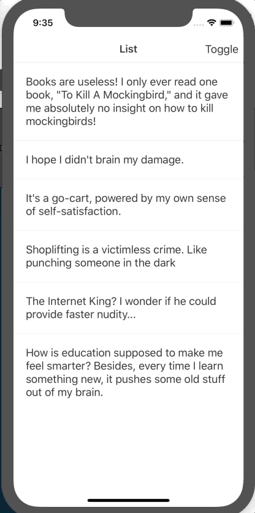

Example uses React Context to enable light mode/dark mode.

To run clone the repo, install node_modules (`yarn install` or `npm install`) then run `react-native run-ios` or `react-native run-android`.

Requires React Native to be installed on your system.



You can view the completed code by changing the import to use the `App-Complete` directory in `index.js`.

```javascript
import App from "./App-Complete";
// import App from "./App-Start";
```
